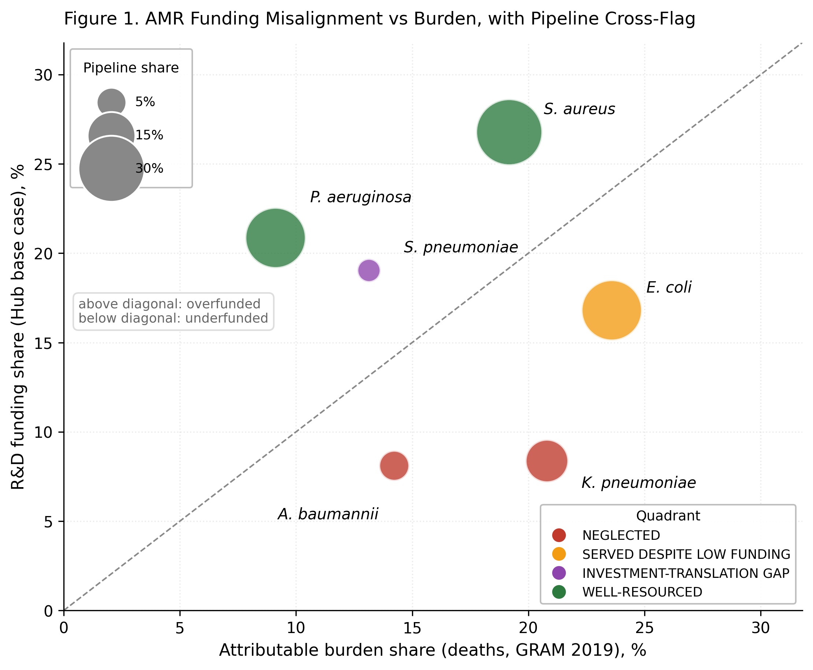
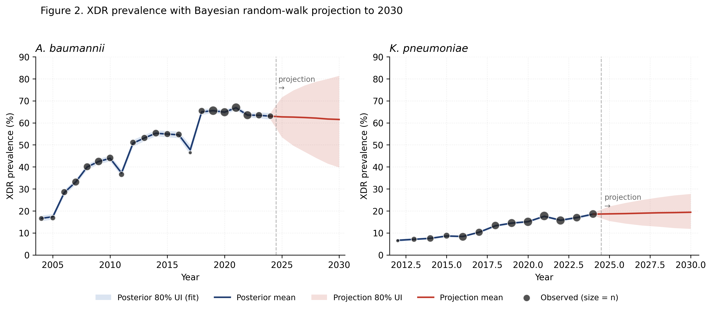

# Is the money going where the deaths are?

**A Global Misalignment Index for antimicrobial resistance (AMR) R&D funding**

*Finalist, 2026 Vivli AMR Surveillance Data Challenge* · Team 13282 · Anthonio Oladimeji & Babatunde Olowu

[📄 Read the report (PDF)](report/AMR_Funding_Misalignment_Team13282_Final.pdf) · [🧭 Decision log](DECISIONS.md) · [⚖️ MIT License](LICENSE)

---

## In one paragraph

The world has committed about **USD 18.9 billion** to AMR research across **18,853 projects** (Global AMR R&D Hub). We asked whether that money goes to the bacteria that kill the most people. We lined up funding, deaths and resistance trends for the six pathogens behind about **73% of attributable AMR deaths**. The answer is no: **a quarter of the funding (25.3%) would have to move** to match the burden. Two WHO critical-priority pathogens, ***Klebsiella pneumoniae*** and ***Acinetobacter baumannii***, are **doubly neglected**: they get too little funding and have too few late-stage drugs in the pipeline. Our Bayesian projection suggests the gap will **widen to about 27.5% by 2030** if nothing changes.

---

## Key findings

| | |
|---|---|
| **Global Misalignment Index (today)** | **25.3%** of pathogen-attributed funding would need to shift to match death share |
| **Robustness** | 15.7%–25.3% across six variants (3 funding-attribution rules × deaths or DALYs) |
| **Doubly neglected** | *K. pneumoniae* (21% of deaths, 8% of funding) and *A. baumannii* (14% of deaths, 8% of funding, only **4** late-stage projects worldwide) |
| **Projected 2030 index** | **27.5%** (80% CI 23.0–32.0%), driven by rising *K. pneumoniae* resistance |
| **Policy ask** | Move **USD 400–600M** of the USD 4.17B base toward *K. pneumoniae* and *A. baumannii*. This closes over half of their combined gap (~USD 770M) and needs no new money. |

### Funding share vs burden share (base case, attributable deaths 2019)

| Pathogen | Funding % | Deaths % | Gap (pp) | Late-stage pipeline % | Quadrant |
|---|---:|---:|---:|---:|---|
| *K. pneumoniae* | 8.4 | 20.8 | **−12.4** | 11.8 | 🔴 Neglected |
| *E. coli* | 16.8 | 23.6 | −6.8 | 25.0 | 🟠 Served despite low funding |
| *A. baumannii* | 8.1 | 14.2 | **−6.1** | 5.3 | 🔴 Neglected |
| *S. pneumoniae* | 19.1 | 13.1 | +5.9 | 2.6 | 🟣 Investment-translation gap* |
| *S. aureus* | 26.8 | 19.2 | +7.6 | 30.3 | 🟢 Well-resourced |
| *P. aeruginosa* | 20.9 | 9.1 | +11.7 | 25.0 | 🟢 Well-resourced |

\* Mostly an artefact of genus-level attribution: Hub "Streptococcus spp." funding also covers *S. pyogenes*, group B strep and vaccine work. We don't treat it as actionable.

### Figures



*Figure 1. Pathogens below the diagonal are underfunded relative to deaths. Bubble size shows each pathogen's share of the late-stage pipeline.*



*Figure 2. Share of isolates in the extensively drug-resistant (XDR) phenotype, observed through 2024 and projected to 2030 (80% uncertainty band). A. baumannii has plateaued near 63%. K. pneumoniae rose from 6.5% (2012) to 18.6% (2024).*

---

## Data sources

| Layer | Source | What we used | In repo? |
|---|---|---|---|
| **Surveillance** | [Vivli AMR Register](https://amr.vivli.org): ATLAS, KEYSTONE, SIDERO-WT | 17,477,785 isolate–drug MIC records, 2004–2024, 89 countries | ❌ Access via Vivli data request |
| **Funding** | [Global AMR R&D Hub](https://globalamrhub.org) dynamic dashboard (`Projects.xlsx`) | 18,853 projects, USD 18.9B; pathogen attribution via the coded `Categories` field | ❌ Download from the Hub |
| **Burden** | GRAM 2019, *Lancet* 2022, appendix Table S22 | Attributable deaths and DALYs per pathogen (six sum to 929k, matching the headline) | ✅ [`data/external/burden_weights.csv`](data/external/burden_weights.csv) |
| **Breakpoints** | EUCAST Clinical Breakpoint Tables v14.0 (2024) | 25 verified breakpoint rows + 7 confirmed no-breakpoint pairs | ✅ [`data/external/breakpoints.csv`](data/external/breakpoints.csv) |

Raw and processed data are **not** committed (see `.gitignore`), in line with Vivli's data-use terms. The two reference tables we built by hand from primary sources are committed, and each was checked line by line against the source document.

---

## Method at a glance

```
 Vivli surveillance (ATLAS, KEYSTONE, SIDERO-WT)       Global AMR R&D Hub          GRAM 2019
            │                                                 │                        │
   1. Harmonize (17.5M records, censored MICs kept)           │                        │
            │                                                 │                        │
   2a. EUCAST v14 S/I/R (censoring-aware)          4a. Funding Allocation      4b. Burden weights
            │                                          Profile (6 pathogens)       (deaths, DALYs)
   2b. Latent Class Analysis → XDR phenotype                  │                        │
            │                                                 └──────────┬─────────────┘
   3. Bayesian random-walk projection of XDR to 2030                     │
            │                                                4c. Global Misalignment Index
            │                                                4d. Pipeline cross-flag (quadrants)
            └──────────────────────────────► Projected 2030 GMI ◄────────┘
```

1. **Harmonization.** Three datasets with three different wide layouts go into one long table: `dataset, isolate_id, organism, country, region, year, specimen, age, gender, antibiotic, mic, mic_numeric, mic_censor`. Censored MICs (`<=0.5`, `>32`) keep an explicit censoring flag. Isolate IDs are dataset-prefixed and guaranteed unique. SIDERO-WT has no native ID, so it gets row-position keys.
2. **Susceptibility calls.** We use EUCAST v14.0 only. CLSI was dropped because its values could not be verified against the primary source. Censored values that straddle a breakpoint are marked *Unresolved* instead of being forced to S or R.
3. **Resistance phenotypes.** Latent Class Analysis (`stepmix`, binary, full-information ML) is fitted separately per pathogen.
   - *A. baumannii*: K = 4, BIC-optimal. The XDR class is 52%, and colistin is the only drug still spared.
   - *K. pneumoniae*: K = 5, chosen on clinical and parsimony grounds. The XDR class is 13%, with 19% colistin resistance.
4. **Funding Allocation Profile.** Projects are mapped to pathogen genus via the Hub `Categories` taxonomy. Multi-pathogen projects are split equally, and funding is assigned to the project start year. The base case counts only projects that name the pathogen. Two sensitivity variants redistribute the broad "Gram-negative" and "Gram-positive" pools, either proportionally or equally.
5. **Global Misalignment Index.** GMI = ½ Σ |funding share − burden share|. This is the total-variation distance between the two distributions: the share of funding that would have to move for perfect alignment.
6. **Pipeline cross-flag.** We count 251 late-stage therapeutic projects (Development + Approval, the WHO/PEW convention). Crossing the sign of the gap with pipeline share (median split) puts each pathogen in one of four quadrants.
7. **Projection to 2030.** A Beta-binomial random walk on logit XDR prevalence, written in Stan and fitted through 2024 (2025 is excluded as incomplete). Diagnostics are clean. 8,000 posterior draws are carried through the GMI calculation, assuming attributable burden scales with XDR prevalence relative to 2019.

Every choice above, with its reasoning and the alternatives we rejected, is logged in [**DECISIONS.md**](DECISIONS.md) (D-001 to D-019).

---

## Repository structure

```
amr-funding-gap/
├── README.md
├── DECISIONS.md              # Full decision log (what we chose and why)
├── LICENSE                   # MIT
├── requirements.txt          # Pinned Python dependencies
├── data/
│   ├── external/             # Committed, verified reference tables
│   │   ├── breakpoints.csv   #   EUCAST v14.0 breakpoints
│   │   └── burden_weights.csv#   GRAM 2019 attributable deaths/DALYs
│   ├── raw/                  # (not committed) Vivli + Hub source files
│   ├── interim/              # (not committed) harmonized / classified tables
│   └── processed/            # (not committed) model outputs, figures
├── docs/figures/             # Figures shown in this README
├── report/                   # Final submitted report (PDF + Markdown source)
└── src/amr_gap/
    ├── harmonize.py          # Step 1   – unify ATLAS / KEYSTONE / SIDERO-WT
    ├── breakpoints.py        # Step 2a  – censoring-aware EUCAST S/I/R
    ├── lca.py                # Step 2b  – latent class phenotyping
    ├── fap.py                # Step 4a  – Funding Allocation Profile
    ├── gmi.py                # Step 4b  – Global Misalignment Index
    ├── pipeline.py           # Step 4c  – pipeline cross-flag / quadrants
    ├── xdr_prep.py           # Step 3a  – XDR time series by profile
    ├── xdr_project.py        # Step 3b  – Stan fit + projection
    ├── gmi_projected.py      # Step 3c  – projected 2030 GMI
    ├── stan/xdr_rw.stan      # Random-walk Beta-binomial model
    ├── figure1.py, figure2.py# Report figures
    └── *_inspect / *_diagnostic / *_compare / coresistance.py
                              # Exploration + decision-support scripts
```

---

## Reproducing the analysis

**Requirements:** Python 3.13, CmdStan 2.39 (for Step 3). The ATLAS file is 388 MB, so harmonization is chunked.

```bash
git clone https://github.com/anthoniooladimeji11-coder/amr-funding-gap.git
cd amr-funding-gap
python -m venv .venv && source .venv/bin/activate
pip install -r requirements.txt pyarrow==24.0.0   # pyarrow is needed for Parquet I/O
python -c "import cmdstanpy; cmdstanpy.install_cmdstan()"   # one-time
```

**Place the source data** (not distributed here):

```
data/raw/Projects.xlsx                                   # Global AMR R&D Hub export
data/raw/Data Challenge/ATLAS_Antibiotics/atlas_vivli_2004_2024.csv
data/raw/Data Challenge/KEYSTONE/Omadacycline_2015 to 2025_Surveillance_data.xlsx
data/raw/Data Challenge/SIDERO-WT/<SIDERO-WT workbook>.xlsx
```

**Run the pipeline in order:**

```bash
export PYTHONPATH=src
python -m amr_gap.harmonize --all      # Step 1   → data/interim/*_long.parquet
python -m amr_gap.breakpoints          # Step 2a  → data/interim/core_pathogens_sir.parquet
python -m amr_gap.lca                  # Step 2b  → data/processed/lca_{acba,klpn}.parquet
python -m amr_gap.fap                  # Step 4a  → data/processed/fap_pathogen_year.parquet
python -m amr_gap.gmi                  # Step 4b  → data/processed/gmi.parquet
python -m amr_gap.pipeline             # Step 4c  → data/processed/pipeline_cross.parquet
python -m amr_gap.xdr_prep             # Step 3a  → XDR time series
python -m amr_gap.xdr_project          # Step 3b  → posterior draws to 2030
python -m amr_gap.gmi_projected        # Step 3c  → data/processed/gmi_projected_2030.parquet
python -m amr_gap.figure1              # Figure 1
python -m amr_gap.figure2              # Figure 2
```

Random seeds are fixed (LCA `random_state=42`, Stan `seed=42`).

---

## Limitations (stated openly)

- **Genus vs species.** The Hub attributes funding to genus (e.g. *Klebsiella* spp.), while burden is species-level. That's a close proxy for five of the six pathogens but loose for *Streptococcus*.
- **Time mismatch.** Funding is cumulative, while burden is the 2019 cross-section. We frame the comparison as cumulative R&D effort against the burden it is meant to address.
- **No drug-class resolution.** The Hub has no drug-class field, so the GMI works at pathogen level.
- **Projection assumption.** Burden is assumed to scale linearly with XDR prevalence, and only two of the six pathogens are projected. The 80% interval of the 2030 GMI overlaps today's value. The central estimate rises, but we can't be highly confident the index will worsen.
- **No patient outcomes** in the Vivli datasets, so burden comes from GRAM. The SPIDAAR linkage dataset was requested but unavailable.
- **Pipeline counts** use project counts as a proxy for candidate counts, and small numbers (e.g. *A. baumannii* = 4) carry sampling noise.

---

## Citation

> Oladimeji A, Olowu B. *A Global Misalignment Index for AMR R&D Funding: Quantifying Where Investment Falls Short of Burden, and Where the Pipeline Compounds the Gap.* 2026 Vivli AMR Surveillance Data Challenge. https://github.com/anthoniooladimeji11-coder/amr-funding-gap

## Key references

1. Antimicrobial Resistance Collaborators. Global burden of bacterial antimicrobial resistance in 2019. *Lancet* 2022;399:629–655.
2. EUCAST. Breakpoint tables for interpretation of MICs and zone diameters, v14.0. 2024.
3. WHO Bacterial Priority Pathogens List, 2024.
4. WHO. 2023 Antibacterial agents in clinical and preclinical development. 2024.
5. Magiorakos AP et al. MDR, XDR and PDR bacteria: interim standard definitions. *Clin Microbiol Infect* 2012;18:268–281.

Full reference list: see the [report](report/AMR_Funding_Misalignment_Team13282_Final.pdf).

## Acknowledgements

Surveillance data were provided through the **Vivli AMR Register** under the 2026 Data Challenge, by the ATLAS (Pfizer), KEYSTONE (Paratek) and SIDERO-WT (Shionogi) programmes. Funding data come from the **Global AMR R&D Hub**, and burden estimates from the **GRAM** project (IHME / University of Oxford).

**Use of AI.** We used Claude (Anthropic) extensively: for pipeline design, writing code, framing decisions, drafting the report and reviewing methods. The human team checked the primary sources (EUCAST tables, GRAM appendix), made the domain judgements (e.g. *Klebsiella* K = 5), handled data access and ran the analysis.

## License

Code: [MIT](LICENSE). The data remain subject to their providers' terms. They are not redistributed here.
